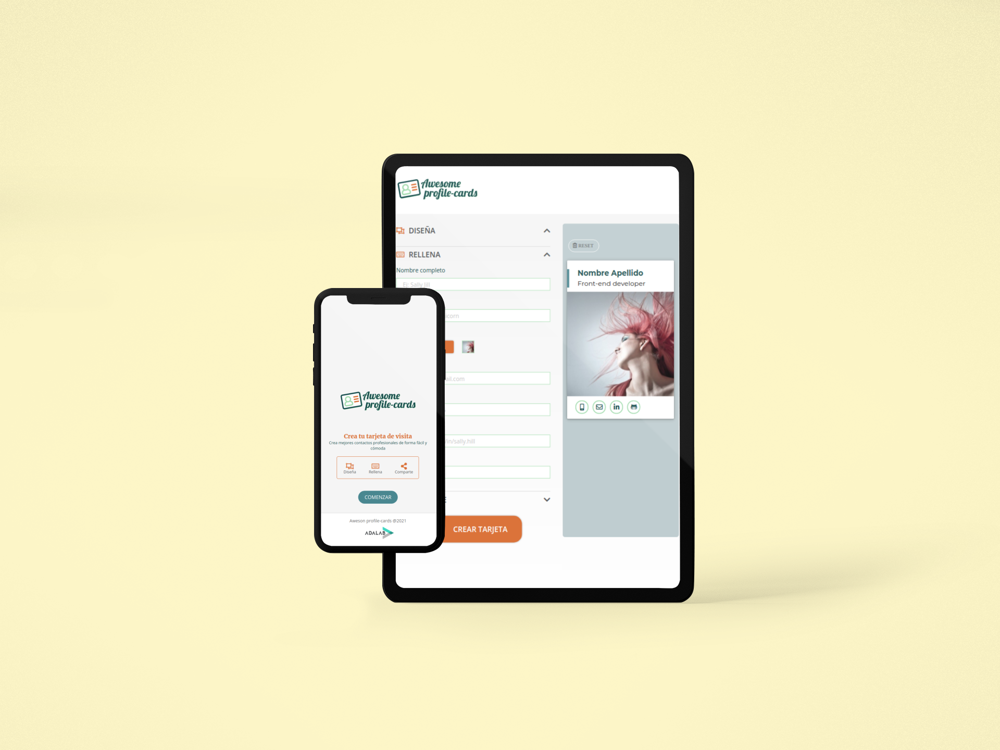

# Awesome Profile Cards

Awesome Profile-Cards es una aplicación web que nos permite crear una tarjeta de visita personalizada.

Partimos de un diseño cerrado facilitado por el product owner a través de Zeplin.
La web está formada por una página landing que enlaza con otra en la que puedes generar tu tarjeta virtual. En ella puedes personalizar el contenido mediante una paleta de colores, un formulario para tus datos, añadir una foto, una visualización previa de la propia tarjeta y el botón de generar.

El resultado es un link con la URL de la tarjeta virtual, que podrás compartir directamente en Twitter.

----------------------------

## Construido con :gear: :hammer_and_wrench:

- Adalab-web-starter-kit
- HTML
- SASS
- GULP
- JavaScript
-------------------------------
## Autoras  :woman_technologist:

- **Claudia Berrocal** [Github](https://github.com/claudiabg-c)
- **Patri Malvido** [Github](https://github.com/PatriMalvido)
- **Norma Rivas** [Github](https://github.com/NormaDeveloper)
- **Mireia Suefra** [Github](https://github.com/mireiasuefra)
- **Begoña** [Github](https://github.com/Begodpo)

--------------------------------

## Licencia 📄 

Este proyecto está bajo la Licencia MIT License mira el archivo [LICENSE](LICENSE) para más detalles

